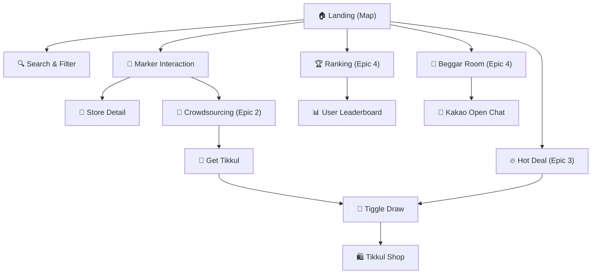

# 🗺️ Beggar Map (거지맵) Master IA v2

> [!TIP]
> 본 문서는 **Mermaid(로직)**와 **CDN 이미지(UI)**를 결합하여 만든 최신 버전의 정보 구조도입니다. 모든 이미지는 CDN을 통해 제공되어 어떤 환경에서도 안정적으로 렌더링됩니다.

## 1. 서비스 로직 구조 (Mermaid Flow)

## 2. 화면별 상세 UI 참조 (Visual Asset Board)

| 서비스 영역     | 핵심 화면 (UI)                                                                                                                                           | 주요 기능 요약              | 관련 에픽/로직                                   |
| :--------- | :--------------------------------------------------------------------------------------------------------------------------------------------------- | :-------------------- | :----------------------------------------- |
| **메인/지도**  |  ![[Assets/Screenshots/beggar_map_main.png\|100]]           | 위치 기반 가성비 마커 노출 및 필터링 | [[거지맵 - Epic 1 탐색 및 필터 시스템|Epic 1]]      |
| **식당 상세**  |  ![[Assets/Screenshots/flow_marker_detail.png\|100]]     | 가격, 메뉴 정보 및 제보/수정 진입점 | [[거지맵 - Epic 2 크라우드소싱 데이터 관리|Epic 2]]    |
| **랭킹/순위**  |  ![[Assets/Screenshots/flow_ranking.png\|100]]                 | 지역별 가성비 왕초 식당 및 유저 순위 | [[거지맵 - Epic 4 랭킹 및 커뮤니티 연동|Epic 4]]     |
| **커뮤니티**   |  ![[Assets/Screenshots/beggar_map_community.png\|100]] | 실시간 거지방 연동 및 정보 공유    | [[거지맵 - Epic 4 랭킹 및 커뮤니티 연동|Epic 4]]   |
| **드로우/보상** |  ![[Assets/Screenshots/flow_draw.png\|100]]                       | 티끌 소모를 통한 경품 확률형 응모   | [[거지맵 - Epic 3 게이미피케이션 보상 시스템|Epic 3]] |
| **티끌 상점**  |  ![[Assets/Screenshots/flow_store.png\|100]]                     | 적립된 포인트로 상품 구매 및 교환   | [[거지맵 - Epic 3 게이미피케이션 보상 시스템|Epic 3]] |

---
## 🔗 관련 분석 문서
- [[Analysis/거지맵 - Epic 1: 탐색 및 필터 시스템|Epic 1: 탐색]]
- [[Analysis/거지맵 - Epic 2: 크라우드소싱 데이터 관리|Epic 2: 제보]]
- [[Analysis/거지맵 - Epic 3: 게이미피케이션 보상 시스템|Epic 3: 보상]]
- [[Analysis/거지맵 - Epic 4: 랭킹 및 커뮤니티 연동|Epic 4: 커뮤니티]]
