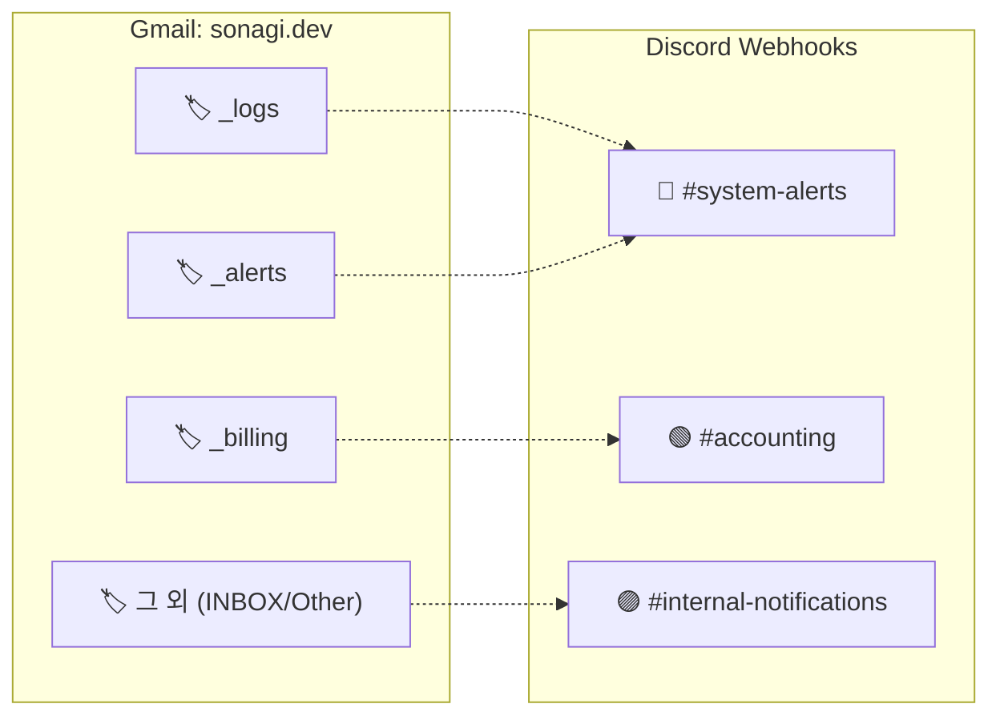
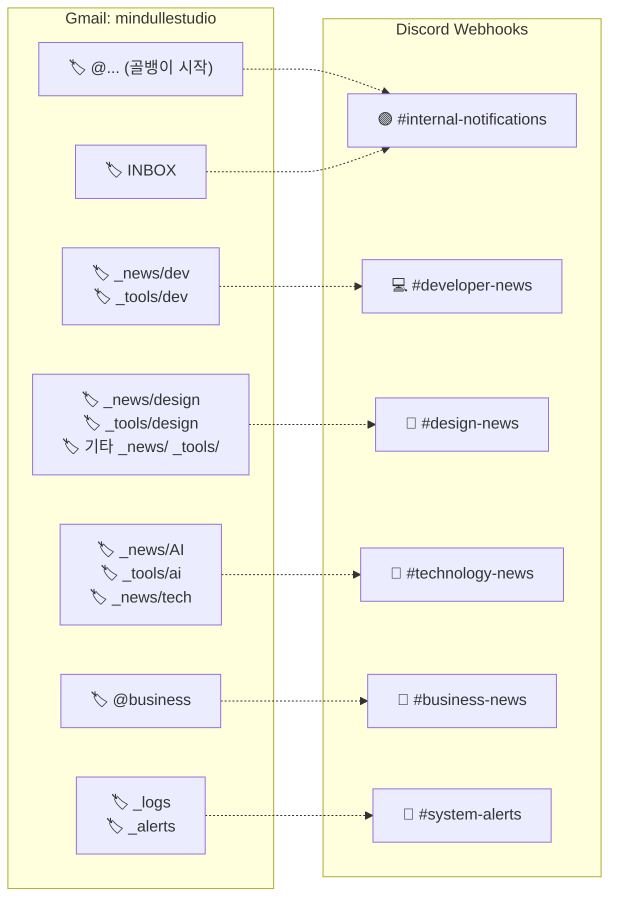
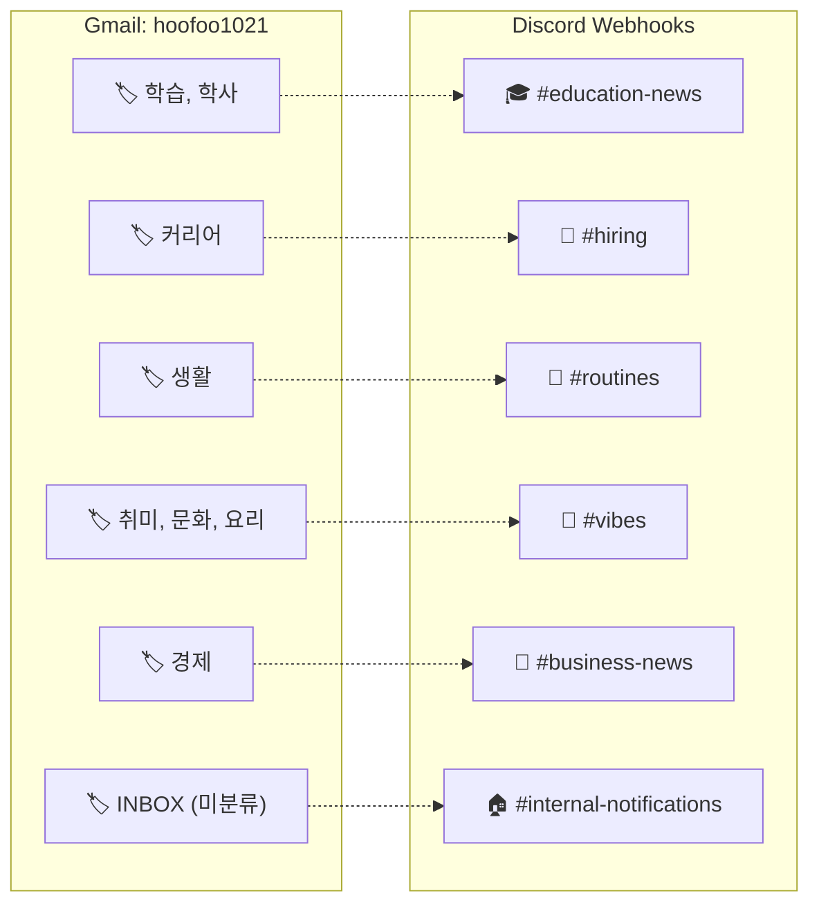

# [Bot] Gmail to Discord 자동화 워크플로우

이 문서는 n8n을 활용하여 여러 Gmail 계정(sonagi.dev, mindullestudio, hoofoo1021)에 수신되는 중요 이메일들을 Discord 채널로 실시간 포워딩해 주는 **Gmail to Discord Bot**의 구조와 라우팅 규칙을 정리합니다.

## 📌 개요
- **목적:** 여러 계정의 주요 메일을 놓치지 않도록 Discord 알림으로 통합 수신
- **작동 주기:** 5분 (`Schedule Trigger`)
- **대상 계정:**
  - `sonagi.dev`
  - `mindullestudio`
  - `hoofoo1021`

## 🛡️ 안정성 및 아키텍처 설계 (공통)
과거 병렬(Parallel) 처리 방식으로 인해 발생했던 **디스코드 알람 무한 폭주(Infinite Loop) 이슈**를 해결하기 위해, 다음과 같은 안전장치와 직렬(Linear) 파이프라인 설계가 적용되었습니다.

1. **완전한 직렬(Linear) 파이프라인:** 
   `메일 검색 ➡️ 라벨 매핑 ➡️ 읽음 처리(Mark As Read) ➡️ 디스코드 전송` 순서로 일직선 연결하여, 전송 중 에러가 발생해도 '읽음 처리'가 누락되지 않도록 사이클을 제거했습니다.
2. **최근 1시간 필터링 (`newer_than:1h`):**
   시스템 오류로 인해 과거에 읽음 처리가 누락된 메일이 대량으로 쌓여있더라도, 최근 1시간 이내의 메일만 가져오도록 필터링하여 무한 알람 폭주를 원천 차단합니다.
3. **비상 복구용 수동 트리거:**
   시스템 장애로 알람이 누락되었을 경우를 대비해, 수동으로 찔러 최근 1일 치(`newer_than:1d`) 메일을 복구/재전송할 수 있는 `Webhook Recovery Trigger`를 분리해 두었습니다.

---

## 🔀 계정별 라벨 및 웹훅 라우팅 매핑

각 계정별로 사용하는 메일 라벨 체계가 다르기 때문에, 디스코드로 전송되는 라우팅 규칙(어떤 라벨이 어느 채널로 갈지)도 다르게 설계되어 있습니다.

### 1️⃣ sonagi.dev 계정
주로 시스템 관리, 서버 로그, 결제 알림 등 인프라와 직결된 메일을 처리합니다.

### 2️⃣ mindullestudio 계정
스튜디오 작업, 개발 및 디자인 뉴스, 구독 정보, 내부 소식 등 다양한 카테고리의 메일을 세밀하게 라우팅합니다.

### 3️⃣ hoofoo1021 계정
뉴스레터 구독(Readwise, TOOOLS.design 등) 및 라이프스타일, 학습, 커리어 관련 순수 한글 라벨 카테고리를 처리합니다.

---

## ⚙️ 노드 구성 흐름 (Workflow Data Flow)
1. `Schedule Trigger (5m)` (최근 1시간 내 메일만 대상)
2. `Gmail: Get All Labels for Mapping` (해당 계정의 전체 라벨 메타데이터 수집)
3. `Set All Labels Property` (코드 노드: JSON 객체로 라벨 ID-Name 사전 준비)
4. `Gmail: Search Unread (계정별 라벨 검색)` (안 읽은 메일 검색)
5. `Mark As Read` (가져온 메일 먼저 즉시 읽음 처리)
6. `Format and Route` (코드 노드: 위 라우팅 테이블에 따라 채널 선택 및 포맷팅)
7. `Discord: Native Webhook Dispatch` (최종 발송)
