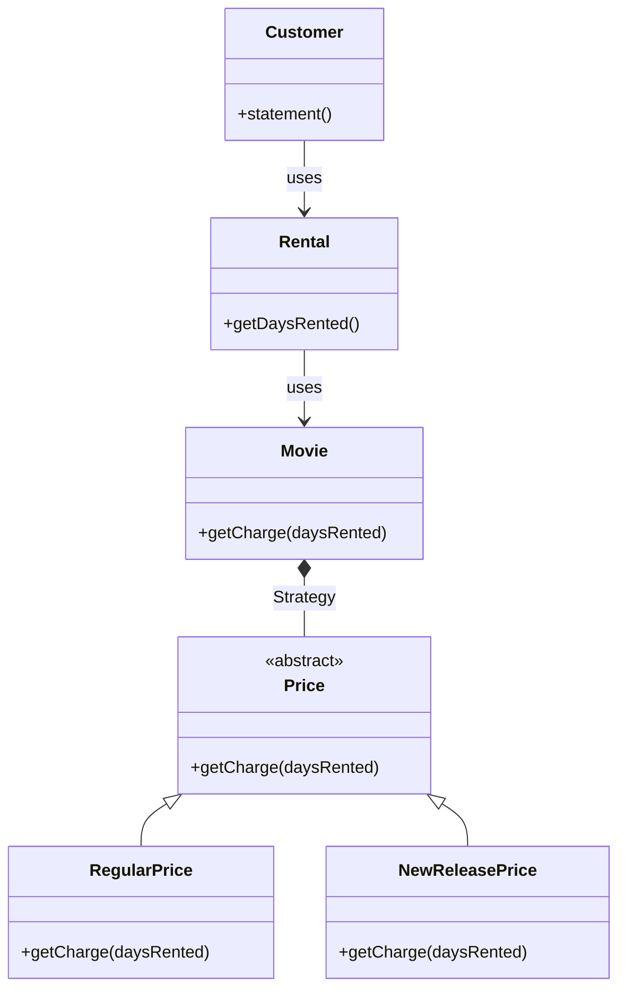
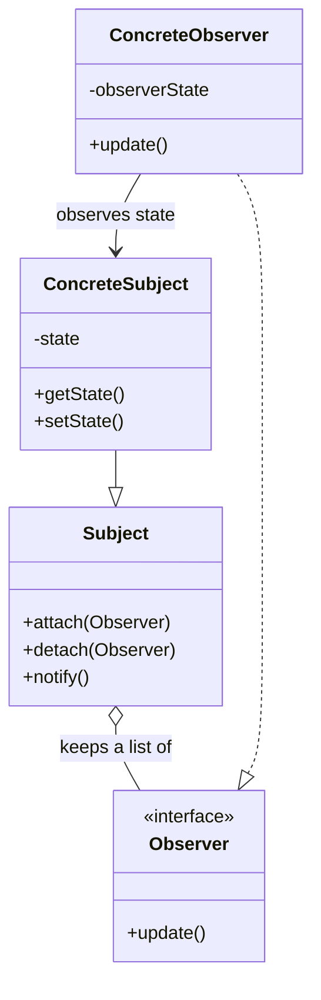
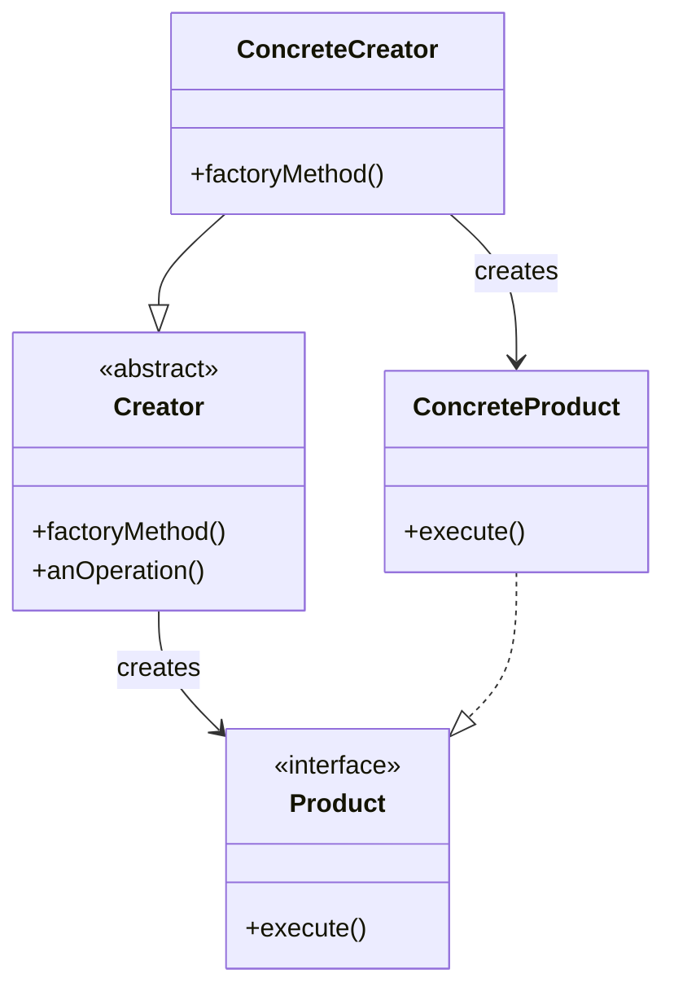

# 소프트웨어 시스템 설계: 서술형 및 UML 심화 대비 스페셜 노트 (실제 강의/과제 예제 100% 반영 버전)

본 노트는 채흥석 교수님의 실제 강의 자료와 과제(Video Rental, BankAccount 등)를 기반으로 작성된 **심화 서술형/아키텍처 전용 방어 노트**입니다. 오픈북 시험에서 요구하는 "다양한 패턴의 융합과 구조적 장점"을 서술하기 위한 완벽한 치트시트입니다.

---

## 🎯 1. 리팩토링과 다형성: Video Rental 예제 (과제 3 핵심)
마틴 파울러(Martin Fowler)의 고전적인 **Video Rental(비디오 대여점)** 코드를 리팩토링하는 과정은 다형성과 OCP를 묻기 가장 좋은 킬러 문항입니다.

### 🚫 [Refactoring 이전: 거대한 Switch문과 Feature Envy]
기존 `Customer` 클래스는 비디오 대여료를 계산하기 위해 `Movie`의 데이터를 마구잡이로 가져와 직접 계산하는 '기능에 대한 욕심(Feature Envy)' 악취를 풍겼습니다.
```java
// 기존 Customer.statement() 내부 로직
switch (each.getMovie().getPriceCode()) {
    case Movie.REGULAR:
        thisAmount += 2;
        break;
    case Movie.NEW_RELEASE:
        thisAmount += each.getDaysRented() * 3;
        break;
    // ...
}
```

### ✨ [Refactoring 이후: Replace Type Code with State/Strategy]
`switch` 문을 없애고 요금 계산 알고리즘을 캡슐화하기 위해 `Price` 클래스 계층구조를 만들었습니다.
```java
abstract class Price {
    abstract double getCharge(int daysRented);
}
class RegularPrice extends Price {
    @Override
    double getCharge(int daysRented) { return 2 + (daysRented > 2 ? (daysRented - 2) * 1.5 : 0); }
}
class NewReleasePrice extends Price {
    @Override
    double getCharge(int daysRented) { return daysRented * 3; }
}
```

### 📊 [UML 구조 시각화: Strategy 적용]

* **서술 득점 포인트**: "새로운 영화 종류가 추가되어도 `Price` 서브클래스만 추가하면 되므로 **개방-폐쇄 원칙(OCP)**을 완벽히 준수합니다."

---

## 🎯 2. 행위 패턴의 꽃: Observer (관찰자 패턴)
시스템의 상태 변화가 발생할 때, 결합도(Coupling)를 낮추면서 다수의 객체에게 이벤트를 전파하는 설계입니다.

### 📊 [UML 구조 시각화: Observer 패턴]

* **서술 득점 포인트**: "Subject는 Observer의 구체적인 구현(ConcreteObserver)을 전혀 알 필요가 없으며, 오직 `Observer` 인터페이스에만 의존합니다. 이는 **의존성 역전 원칙(DIP)**을 달성하여, 발행자(Publisher)와 구독자(Subscriber) 간의 결합도를 느슨하게(Loosely Coupled) 유지하는 핵심 철학입니다."
* **Push vs Pull**: Subject가 데이터를 파라미터로 밀어 넣어주면 Push, Observer가 알림만 받고 `getState()`로 직접 당겨오면 Pull 방식입니다.

---

## 🎯 3. 객체 생성의 캡슐화: Factory Method (팩토리 메서드)
객체를 생성하는 로직을 클라이언트 코드에서 분리하여 서브클래스로 위임하는 디자인 패턴입니다.

### 📊 [UML 구조 시각화: Factory Method]

* **서술 득점 포인트**: "클라이언트가 객체를 직접 `new` 키워드로 생성하면 구상 클래스에 강하게 결합됩니다. 팩토리 메서드 패턴은 객체 생성의 책임을 서브클래스(`ConcreteCreator`)로 미루어(위임하여), 새로운 `Product`가 추가되더라도 기존 코드를 변경할 필요 없게 만듭니다."

---

## 🎯 4. 단위 테스트와 코드 커버리지: BankAccount & PasswordValidator
### 🏦 시나리오 A: BankAccount (예외 처리 및 상태 검증)
```java
@Test
@DisplayName("출금액이 잔액을 초과할 때 예외 발생 검증")
void testWithdraw_ExceedBalance() {
    BankAccount account = new BankAccount(500); 
    IllegalArgumentException exception = assertThrows(
        IllegalArgumentException.class, 
        () -> account.withdraw(1000)
    );
    assertEquals("잔액이 부족합니다.", exception.getMessage());
}
```
* **서술 득점 포인트**: "성공하는 Happy Path뿐 아니라, 경계값(Boundary Value)에서의 예외 던지기를 검증해야 합니다."

### 🔐 시나리오 B: PasswordValidator와 JaCoCo 커버리지의 한계
* **서술 득점 포인트**: "Line Coverage가 100%라도, 조건식 내부의 논리 연산자(`&&`, `||`)의 모든 조합이 참/거짓으로 평가되지 않았다면 잠재적 버그가 남아있습니다. 따라서 복잡한 조건문은 **Branch Coverage(분기 커버리지)** 측면에서 테스트를 설계해야 합니다."

---

## 🎯 5. AI 에이전트 설계: Pydantic과 External Tools (수업 범위)

### 🛡️ [Pydantic과 LLM의 결합: Adapter 패턴 관점]
```python
from pydantic import BaseModel, Field

class ToolOutput(BaseModel):
    action: str = Field(description="실행할 도구 이름")
    parameters: dict = Field(description="도구 파라미터")
```
* **서술 득점 포인트**: "Pydantic은 본질적으로 통제 불가능한 LLM(비정형 텍스트)의 출력을 내부 시스템이 사용할 수 있는 정형 데이터(JSON)로 변환해주는 **어댑터(Adapter)** 역할을 수행합니다."

### 🔄 [Action-Observation 루프와 객체지향 패턴]
* 에이전트가 외부 도구를 런타임에 갈아 끼우며 실행하는 것은 **Strategy 패턴**입니다.
* 도구 실행 결과(Observation)를 보고 다음 행동을 결정하는 제어 흐름은 **State 패턴**의 구조와 일치합니다.
