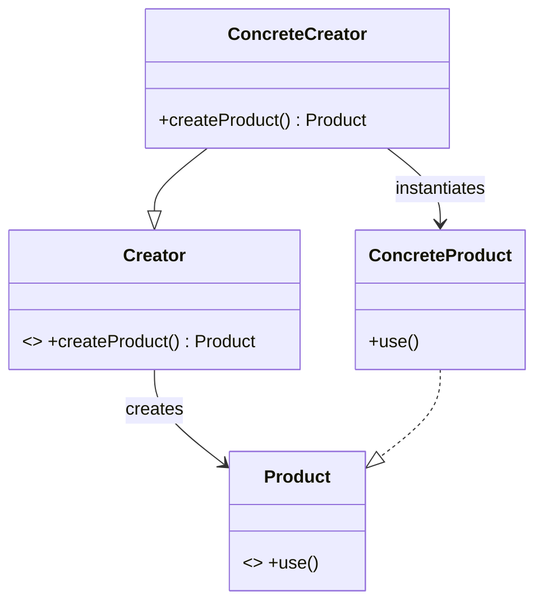
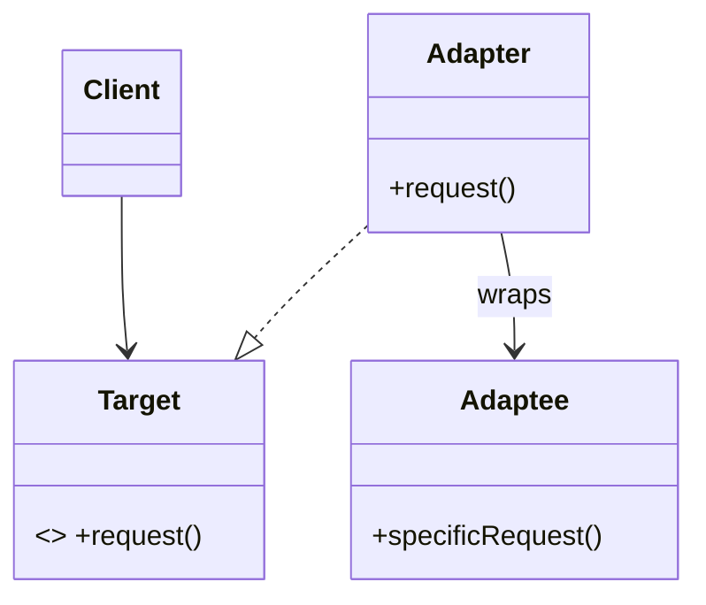
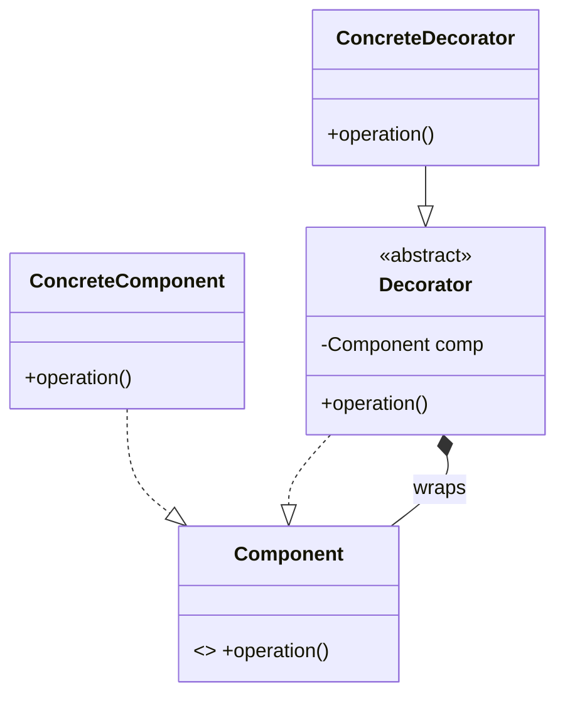
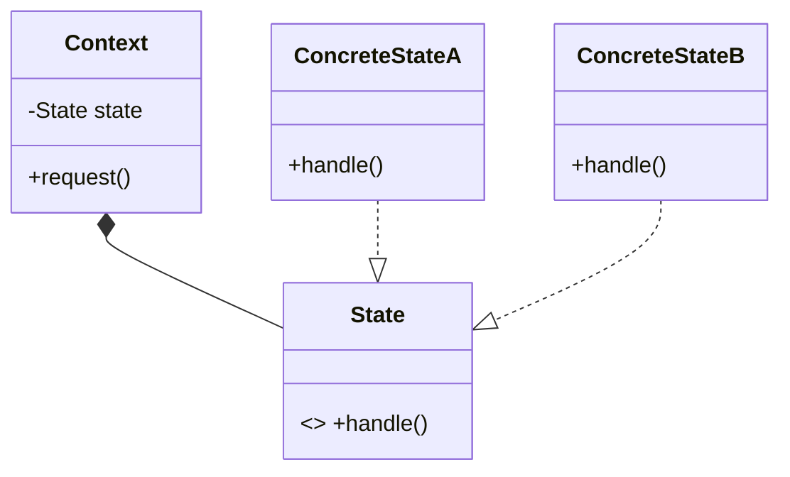

# 📘 소프트웨어 시스템 설계: 오픈북 마스터 치트시트 (전 범위 통합본)

본 문서는 오픈북 시험에 최적화된 **'합법적 커닝 페이퍼(Cheat Sheet)'**입니다. 강의 범위 내의 모든 핵심 디자인 패턴, 리팩토링, 테스트, AI 에이전트 설계 원칙과 UML, 코드 예제를 꼼꼼하게 단권화했습니다.

---

## 🏗️ 1. 생성 패턴 (Creational Patterns)
객체 인스턴스화를 캡슐화하여 결합도를 낮추는 패턴들입니다.

### 1.1 Singleton (싱글톤)
* **목적**: 오직 하나의 인스턴스만 생성하고 전역 접근점 제공.
* **오픈북 득점 포인트**: 멀티스레딩 환경에서의 동시성(Concurrency) 문제 해결 방안.

```java
// [가장 완벽한 Thread-safe 싱글톤: Bill Pugh Solution (정적 내부 클래스)]
public class Singleton {
    private Singleton() {} // 생성자 private
    
    private static class SingletonHolder {
        private static final Singleton INSTANCE = new Singleton();
    }
    
    public static Singleton getInstance() {
        return SingletonHolder.INSTANCE; // 호출 시점에 클래스 로드 (지연 초기화 보장)
    }
}
```

### 1.2 Factory Method (팩토리 메서드)
* **목적**: 객체 생성 책임을 구상 서브클래스에 위임. 클라이언트는 인터페이스에만 의존.



### 1.3 Builder (빌더)
* **목적**: 복잡한 객체의 생성과 표현을 분리.
* **오픈북 득점 포인트**: 점층적 생성자(Telescoping Constructor) 패턴의 가독성 저하를 막고, 객체의 불변성(Immutability)을 보장하기 위해 사용.

---

## 🏛️ 2. 구조 패턴 (Structural Patterns)
클래스나 객체를 조합하여 더 큰 구조를 형성하는 패턴입니다.

### 2.1 Adapter (어댑터)
* **목적**: 호환되지 않는 인터페이스를 클라이언트가 기대하는 인터페이스로 변환.



### 2.2 Decorator (데코레이터)
* **목적**: 서브클래싱(상속)의 대안으로, 객체에 동적으로 새로운 책임을 추가.
* **UML 키포인트**: 데코레이터가 컴포넌트를 **상속(구현)**함과 동시에 내부에 **합성(Composition)**으로 들고 있어야 함.



### 2.3 Facade (파사드)
* **목적**: 복잡한 서브시스템들에 대한 통합된 단일 인터페이스 제공. (의존성 최소화)

---

## 🎭 3. 행위 패턴 (Behavioral Patterns)
객체 간의 알고리즘과 책임 할당, 메시지 통신을 다룹니다.

### 3.1 Strategy (전략) vs State (상태)
* **Strategy**: 런타임에 **알고리즘**을 교체. 클라이언트가 전략을 직접 주입(선택)하는 경우가 많음.
* **State**: 객체의 내부 상태가 바뀜에 따라 행위가 변경됨. 보통 상태 전이(State Transition) 로직이 캡슐화되어 있어 클라이언트가 개입하지 않음.



### 3.2 Observer (관찰자)
* **목적**: 1:N 의존성. 객체 상태 변화 시 종속된 객체들에게 자동 알림(Push/Pull).
* **오픈북 득점 포인트**: 결합도를 낮추기 위해 Subject와 Observer는 철저히 인터페이스로만 통신함(DIP 준수).

---

## 🛠️ 4. 리팩토링 (마틴 파울러)
나쁜 냄새(Code Smells)를 제거하여 유지보수성을 높이는 기술.

### 4.1 Replace Type Code with State/Strategy
거대한 `switch-case`로 타입(Type)을 분기하는 코드는 OCP를 위배함. 다형성(Polymorphism)으로 해체해야 함.

```java
// [Bad Smell: Switch Statement]
double getSpeed() {
    switch (type) {
        case EUROPEAN: return getBaseSpeed();
        case AFRICAN: return getBaseSpeed() - getLoadFactor();
    }
}

// [Refactored: 다형성 적용]
abstract class Bird { abstract double getSpeed(); }
class European extends Bird { double getSpeed() { return getBaseSpeed(); } }
class African extends Bird { double getSpeed() { return getBaseSpeed() - getLoadFactor(); } }
```

### 4.2 Extract Method
* **목적**: 너무 긴 메서드(Long Method)에서 독립적인 로직을 떼어내어 목적(What)을 드러내는 이름의 메서드로 분리.

---

## 🧪 5. 단위 테스트 (JUnit & Mockito)
### 5.1 Test Double: Stub vs Mock
* **Stub**: 상태 검증(State Verification). 껍데기 객체에 미리 하드코딩된 반환값을 설정해둠.
* **Mock**: 행위 검증(Behavior Verification). 객체 간의 상호작용(어떤 메서드가 몇 번 호출되었는가?)을 기록하고 검증.

### 5.2 JaCoCo 커버리지 함정
* **Line Coverage**: 코드가 한 번이라도 실행되었는가? (100%라도 안전하지 않음)
* **Branch Coverage**: `if (A && B)` 같은 복합 조건에서 A와 B의 참/거짓 조합 분기가 모두 타졌는가?

---

## 🤖 6. AI 에이전트 시스템 아키텍처
LLM과 소프트웨어 공학의 결합.

### 6.1 Pydantic (Structured Output & 검증)
* 외부 시스템인 LLM의 무정형 출력을 강타입(JSON) 객체로 파싱하고 검증하는 **Adapter 패턴** 역할.
```python
from pydantic import BaseModel
class ResponseSchema(BaseModel):
    summary: str
    confidence_score: float
# LLM 응답을 파싱할 때 에러가 나면 즉각 거부(안전성 확보)
```

### 6.2 Action-Observation (ReAct) 루프
* 에이전트가 `생각(Thought) -> 도구 실행(Action) -> 결과 관찰(Observation)`을 반복하는 것은 **State 패턴**(상태 전이) 및 **Strategy 패턴**(도구 교체)의 융합 아키텍처.

---

## 📐 [부록] UML 클래스 다이어그램 그리기 퀵 레퍼런스 (Cheat Sheet)
시험 중 UML을 직접 손으로 그려야 할 때 절대 헷갈리지 않도록 돕는 기호 및 화살표 총정리 표입니다.

### 1. 접근 제어자 (Visibility) 표시법
클래스의 속성(Attribute)과 메서드(Method) 앞에 붙입니다.

| 기호 | 의미 | 설명 |
|:---:|:---|:---|
| `+` | **Public** | 어떤 외부 클래스에서든 자유롭게 접근 가능 |
| `-` | **Private** | 오직 해당 클래스 내부에서만 접근 가능 |
| `#` | **Protected** | 동일 패키지 및 자식(상속받은) 클래스에서 접근 가능 |
| `~` | **Package** | (Default) 동일 패키지 내에서만 접근 가능 |

### 2. 클래스 간의 관계 화살표 (Relationships & Arrows)
가장 헷갈리기 쉬운 화살표 방향과 모양 정리입니다. **화살표의 끝(촉)은 항상 '내가 의존하는 대상(부모, 인터페이스)'을 향합니다.**

| 관계 (Relation) | 핵심 의미 | UML 화살표 모양 | 자바(Java) 코드 예시 |
|:---|:---|:---:|:---|
| **상속 (Generalization)** | 부모 클래스의 기능을 물려받음 (is-a) | **◁━━━** (실선 + 빈 화살촉) | `class Child extends Parent` |
| **실체화 (Realization)** | 추상적인 인터페이스를 구체화함 | **◁- - -** (점선 + 빈 화살촉) | `class Impl implements Inter` |
| **의존 (Dependency)** | 파라미터나 지역 변수로 잠깐 사용 (일시적) | **< - - -** (점선 + 열린 화살촉) | `void use(Target t) { t.run(); }` |
| **연관 (Association)** | 멤버 변수로 참조를 계속 유지함 (지인 관계) | **<━━━** (실선 + 열린 화살촉) | `class A { private B b; }` |
| **집합 (Aggregation)** | 전체-부분 관계이나 생명주기가 다름 (독립적) | **◇━━━** (실선 + 빈 마름모) | `Team`과 `Player` (팀 해체 시 선수는 남음) |
| **합성 (Composition)** | 강력한 전체-부분 관계. 생명주기를 같이 함 | **◆━━━** (실선 + 꽉 찬 마름모) | `House`와 `Room` (집이 철거되면 방도 소멸) |

> 💡 **다이어그램 고득점 꿀팁**
> 1. **인터페이스**는 상자 상단에 `<<interface>>`라는 스테레오타입을 명시하세요.
> 2. **추상 클래스**는 상단에 `<<abstract>>`를 적거나, 클래스 이름과 추상 메서드의 이름을 **이탤릭체(기울임꼴)**로 표기하는 것이 원칙입니다.
